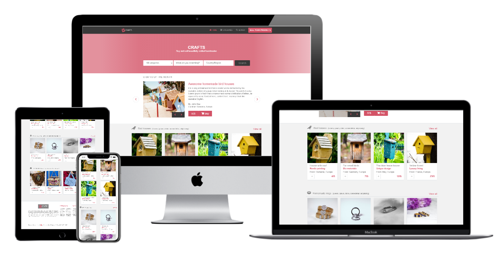
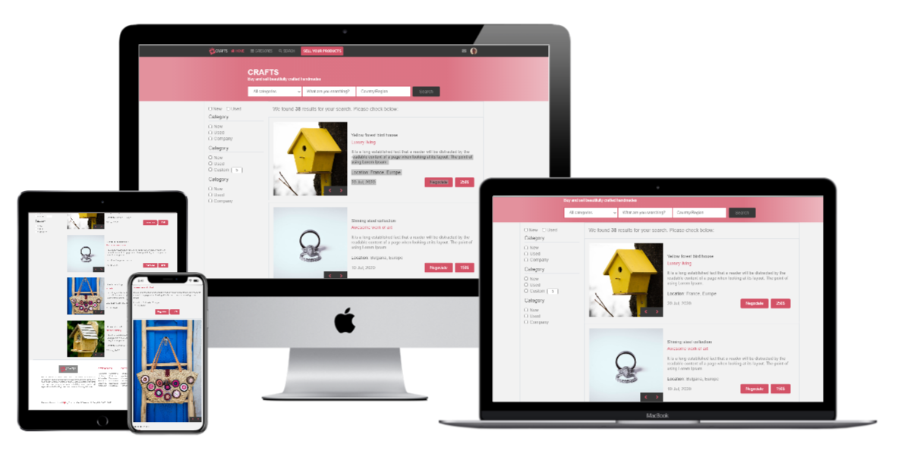

# Online shop (index and search page) - Built time 16 hours

> This is a capstone/exam project for the [Microverse](https://www.microverse.org) module HTML/CSS. It is a Crafts(handmades) website using HTML, CSS3/SCSS, Bootstrap, and Font awesome.

## Watch a video presentation of the project [here](https://www.loom.com/share/1ecb819a678e4b3f8681da87415597cf). The website is built using this [mockup](https://www.behance.net/gallery/24796463/ZATTIX)

## Screenshot of the index page

## Screenshot of the search page

The project is built using HTML and CSS/SCSS with an extensive use of the grid and flex propreties. I used all SCSS core functionality: variables, mixins and color functions.

## Built With

- HTML
- CSS3/SCSS
- Bootstrap
- Font awesome icons
- Webhint/Stylelint linters
- NPM scripts for testing and running the SCSS changes

#### You can check the workflow that I use when building websites by reading my medium article [Organize your HTML and CSS files like a pro](https://medium.com/@cristian.ceamatu/the-best-way-to-clone-create-any-website-in-very-simple-steps-3e4f467567ba)

## Live Demo

[Live Demo index page](https://raw.githack.com/cristianCeamatu/microverse-HTML-CSS-capstone-project-online-shop-for-electronics/dev/index.html)

[Live Demo search page](https://raw.githack.com/cristianCeamatu/microverse-HTML-CSS-capstone-project-online-shop-for-electronics/dev/search.html)

(You can also navigate between pages using the navigation links and the search form.)

## To get a local copy up and running follow these simple example steps.

### Setup

Clone the project locally.

### Linters

1. run `npm install`.
2. run `npm run test` to check the HTML and CSS files.
2. run `npm run watch` to start watching for SCSS changes.

### Deployment

Install and run a live server plugin on you IDE/Text editor and run it from the root directory.

### Future improvements

Add a backend to the page

## Authors

👤 **Cristian Viorel Ceamatu**

- Email: [cristian.ceamatu@gmail.com](cristian.ceamatu@gmail.com)
- Github: [https://github.com/cristianCeamatu](https://github.com/cristianCeamatu)
- Twitter: [https://twitter.com/CristianCeamatu](https://twitter.com/CristianCeamatu)
- Linkedin: [https://www.linkedin.com/in/ceamatu-cristian/](https://www.linkedin.com/in/ceamatu-cristian/)

## Show your support

Give a ⭐️ if you like this project!

## 📝 License

This project is [MIT](lic.url) licensed.
